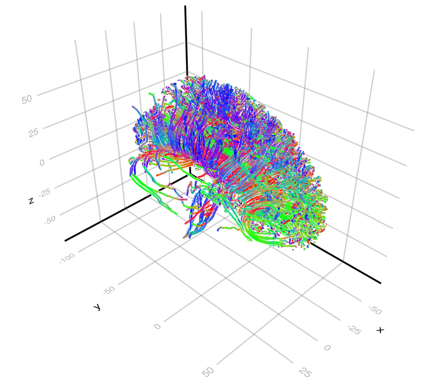

# Tractography.jl

This Julia package aims at tractography by taking advantage of **parallel and specific hardwares (*e.g.* GPU).** Tractography aims at reconstructing white matter fiber bundles using diffusion-weighted MRI. It thus aim to study the structural connectivity of the brain.

## 📦 Installation

Assuming that you already have Julia correctly installed, it suffices to import `Tractography.jl` in the standard way:

`import Pkg; Pkg.add("Tractography")`

## 📚 Citing this work

To come...

## 🧑‍💻 Other softwares

There are several good softwares already available.
- [MRtrix](https://github.com/MRtrix3/mrtrix3/tree/fb66ec3f4c0012be8760dbc0ed52c1824b28b3af) the main software to perform, among other things, tractography. It lacks GPU capability though.
- [Fibers.jl](https://github.com/lincbrain/Fibers.jl) to deal with dMRI data.
- [Trekker](https://dmritrekker.github.io)
- [Entrack](https://vitalab.github.io/article/2019/11/21/entrack.html)

In Julia, the present package seems to be the only one focused on tractography.

## A word on performance

The examples which follow have not **all** been written with the goal of performance but rather simplicity.

However, note that this code was used to sample 500 000 000 000 streamlines on GPU for a recent publication.

- Yanis Aeschlimann, Samuel Deslauriers-Gauthier, Romain Veltz. **GPU tractography: What can we learn from half a trillion streamlines?** International Society for Tractography Conference - IST 2025, Oct 2025, Bordeaux (France), France. [⟨hal-05272265⟩](https://inria.hal.science/hal-05272265v1)